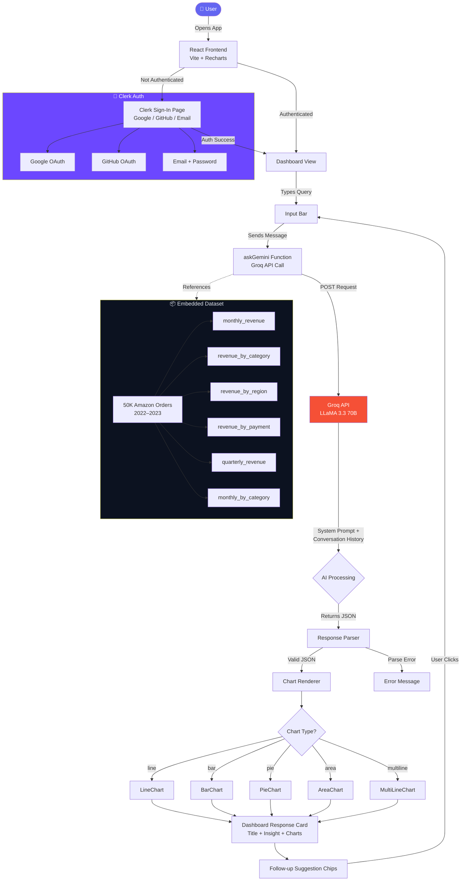
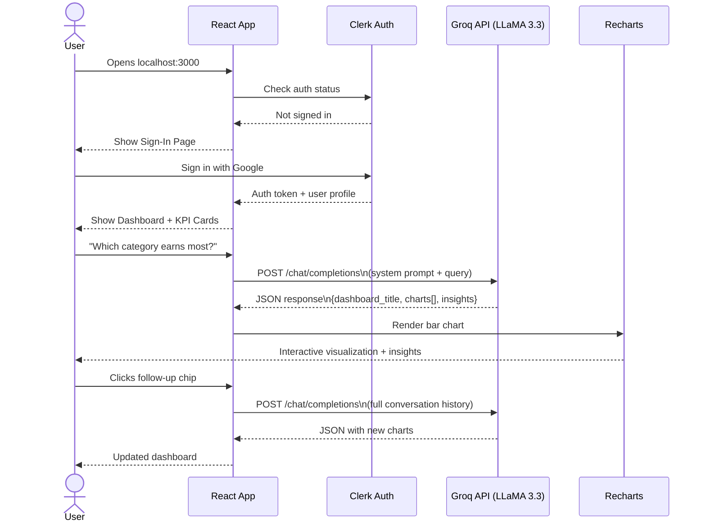

# DataTalk 🤖📊

<div align="center">

**Conversational AI for Instant Business Intelligence Dashboards**

[](https://react.dev)
[](https://vitejs.dev)
[](https://clerk.com)
[](https://groq.com)
[](https://recharts.org)
[](https://vercel.com)


</div>

---

## 📌 Problem Statement

Non-technical business executives struggle to extract insights from large sales datasets. Traditional BI tools require SQL knowledge, complex dashboards, and hours of setup. **DataTalk** solves this by letting anyone ask questions in plain English and instantly get interactive, AI-generated charts and insights.

---

## ✨ Features

- 🔐 **Secure Authentication** — Google, GitHub, Email login via Clerk
- 💬 **Conversational AI** — Ask questions in plain English, get instant dashboards
- 📊 **5 Chart Types** — Line, Bar, Area, Pie, Multiline with Recharts
- 🧠 **Multi-turn Memory** — Follow-up questions maintain full context
- ⚡ **Ultra Fast** — Powered by Groq's LLaMA 3.3 70B (fastest free LLM)
- 📱 **Responsive UI** — Works on desktop, tablet, and mobile
- 🎨 **Dark Theme** — Professional dark UI with smooth animations
- 💡 **Smart Suggestions** — AI generates follow-up query chips automatically
- 📦 **50K Orders Dataset** — Real Amazon Sales data (Jan 2022 – Dec 2023)

---

## 🏗️ System Architecture



---

## 🔄 User Flow



---

## 🛠️ Tech Stack

| Layer | Technology | Purpose |
|-------|-----------|---------|
| **Frontend** | React 18 + Vite | UI framework |
| **Charts** | Recharts 2.12 | Interactive visualizations |
| **Auth** | Clerk v5 | Google/GitHub/Email login |
| **AI** | Groq (LLaMA 3.3 70B) | Natural language → JSON |
| **Styling** | Inline CSS + CSS animations | Dark theme UI |
| **Deployment** | Vercel | Hosting + CI/CD |
| **Dataset** | Amazon Sales CSV (50K rows) | Business data |

---

## 📊 Dataset Overview

| Attribute | Details |
|-----------|---------|
| **Source** | Amazon Sales Dataset (Kaggle) |
| **Rows** | 50,000 orders |
| **Date Range** | January 2022 – December 2023 |
| **Total Revenue** | $32,866,573.74 |
| **Avg Order Value** | $657.33 |
| **Categories** | Beauty, Books, Electronics, Fashion, Home & Kitchen, Sports |
| **Regions** | Asia, Europe, Middle East, North America |
| **Payment Methods** | UPI, Credit Card, Debit Card, Wallet, Cash on Delivery |

---

## 🚀 Getting Started

### Prerequisites
- Node.js 18+
- npm or yarn
- Free accounts on [Groq](https://console.groq.com) and [Clerk](https://dashboard.clerk.com)

### Installation

```bash
# 1. Clone the repo
git clone https://github.com/RICK2814/datatalk.git
cd datatalk

# 2. Install dependencies
npm install

# 3. Create environment file (Windows PowerShell)
[System.IO.File]::WriteAllText(".env.local", "VITE_GROQ_API_KEY=gsk_your-key-here`nVITE_CLERK_PUBLISHABLE_KEY=pk_test_your-key-here")

# 4. Start development server
npm run dev
```

### Environment Variables

| Variable | Where to Get |
|----------|-------------|
| `VITE_GROQ_API_KEY` | [console.groq.com](https://console.groq.com) → API Keys |
| `VITE_CLERK_PUBLISHABLE_KEY` | [dashboard.clerk.com](https://dashboard.clerk.com) → API Keys |

---

## 🌐 Deployment (Vercel)

1. Push to GitHub
2. Go to [vercel.com](https://vercel.com) → **Add New Project** → Import `datatalk`
3. Add environment variables in **Project Settings → Environment Variables**
4. Click **Deploy**
5. Add your Vercel URL to Clerk **Allowed Domains**

---

## 💬 Example Queries

| Query | Chart Generated |
|-------|----------------|
| "Show monthly revenue trend" | Line Chart |
| "Which category earns most?" | Bar Chart |
| "Revenue by payment method" | Pie Chart |
| "Compare regions and categories" | Grouped Bar Chart |
| "Category performance over time" | Multiline Chart |
| "Show quarterly performance" | Area Chart |

---

## 📁 Project Structure

```
datatalk/
├── public/
│   └── favicon.svg
├── src/
│   ├── App.jsx          # Main app (auth + dashboard + AI + charts)
│   ├── main.jsx         # React root + ClerkProvider
│   └── index.css        # Global styles
├── .env.example         # Environment variable template
├── .gitignore
├── index.html
├── package.json
├── vercel.json          # SPA routing config
└── vite.config.js
```

---

## 👥 Team

| Name | Role | College |
|------|------|---------|
| Rohit | Full Stack Developer | JIS College of Engineering, Kalyani |
| Sania | Full Stack Developer | JIS College of Engineering, Kalyani |
|Sambhab| Full Stack Developer | JIS College of Engineering, Kalyani |

> Built with ❤️ 

---

## 📄 License

MIT License — free to use, modify, and distribute.

---

<div align="center">
  <strong>DataTalk</strong> · Amazon Sales · 50,000 orders · 
</div>
